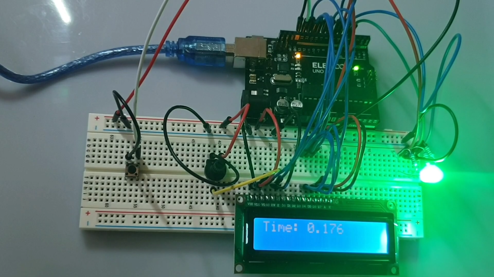

# ArduinoReactionTimeGame
A short game that allows a player to measure their reaction time by reacting to an lcd display, alongside an rgb led light, via a button. The game prompts the player to press the button to begin, then adds a random delay between a 'ready' state and a 'go' state, where the player must press the button as soon as they seen the go state appear. This is represented by a 'GO!' message displayed on the screen, and the respective led appearing green. The device measures the time taken to react, and displays it to the user, before prompting them to play again.

### How To Use
Change, within main.ino, the following definitions:
- #define BS_PIN 7
- #define E_PIN 8
- #define D4_PIN 9
- #define D5_PIN 10
- #define D6_PIN 11
- #define D7_PIN 12

to the pins you're using for the lcd display...
- #define BTN_PIN 13

to the pin you're using for the button input...
- #define R_LED_PIN 6
- #define G_LED_PIN 4
- #define B_LED_PIN 5

to the pins you're using for the RGB (red/green/blue), where R_LED_PIN represents the red pin on the component, for instance.

